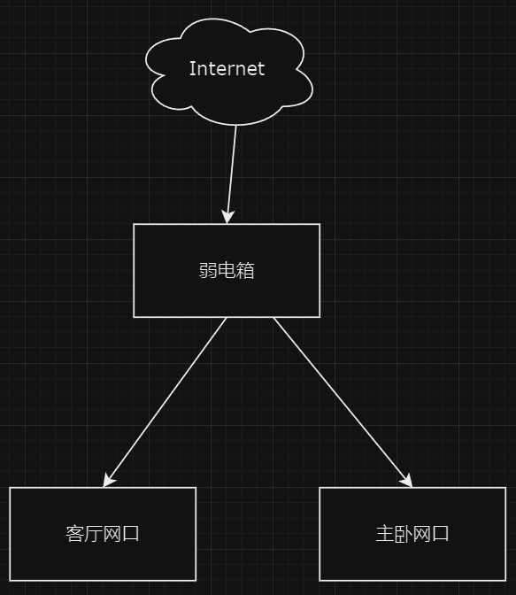

# 单线复用

### 背景

一个路由器无论放在户内的哪个位置，某个房间肯定会有信号不够强的情况，而且书房没有预留网线口。因为精装房户内预先铺设了网线，所以没法改线，所以只能使用单线复用的方式来实现路由器的mesh组网。

### 网线走线图

弱电箱只有一根线连到客厅的网口，正常情况下，如果要用IPTV，就没法用这条网线了

<figure><figcaption></figcaption></figure>

### 改造方案

主要是参考了知乎的 [这篇组网教程](https://www.zhihu.com/tardis/zm/art/343117525) 根据下图，购买了两个交换机和支持mesh组网的子母路由器

<figure><figcaption></figcaption></figure>

因为有软路由，加上后期可能会买NAS，所以交换机直接买8口的。具体走线思路如下图所示

<figure><figcaption></figcaption></figure>

光纤经光猫转网线，进入弱电箱的交换机，然后分开两条线，一条通往客厅，另一条通往主卧。通往主卧的网线直接连接子路由，通往客厅的网线连到客厅的交换机。

客厅的交换机分别接上：从弱电箱交换机过来的网线、客厅主路由WAN口、客厅主路由LAN口、软路由、Apple TV，后续如果需要IPTV的话也可以有空余的网口供使用。

### 交换机设置

#### 弱电箱的交换机

需要把ip设置为与光猫不同的网段，比如我这的光猫的ip是192.168.1.1，那么我可以将交换机的ip设置为192.168.0.x。

<figure><figcaption></figcaption></figure>

接着设置VLAN，如下图所示：

<figure><figcaption></figcaption></figure>

* VLAN1的是默认的，无需理会。
* VLAN2设置为预留给IPTV使用，端口1选中Tagged端口，端口7选中Untagged端口。
* VLAN3设置为WAN进线，端口1选中Tagged端口，端口8选中Untagged端口。
* VLAN4设置为LAN局域网，端口1选中Tagged端口，端口2-6、8选中Untagged端口。

接着设置VLAN PVID，如下图所示：

<figure><figcaption></figcaption></figure>

* 端口2-6设置为4
* 端口7设置为2
* 端口8设置为3

交换机插线：端口8连接光猫、端口1连接客厅交换机、端口2连接主卧子路由、端口7连接IPTV

#### 客厅的交换机

客厅的交换机的ip需要和弱电箱的交换机的ip设置为同一个网段，且ip不能相同。 接着设置VLAN，如下图所示：

<figure><figcaption></figcaption></figure>

* VLAN1的是默认的，无需理会。
* VLAN2设置为预留给IPTV使用，端口8选中Tagged端口，端口1选中Untagged端口。
* VLAN3设置为WAN进线，端口8选中Tagged端口，端口2选中Untagged端口。
* VLAN4设置为LAN局域网，端口8选中Tagged端口，端口3-7选中Untagged端口。

接着设置VLAN PVID，如下图所示：

<figure><figcaption></figcaption></figure>

* 端口1设置为2
* 端口2设置为3
* 端口3-7设置为4

交换机插线：端口8连接从弱电箱交换机过来的网线、端口7连接主路由LAN口、端口2连接主路由WAN口、端口1链接IPTV

### 路由设置

路由需要将网关和DNS设置为光猫的ip地址，也就是192.168.1.1。其他功能无需额外设置。
