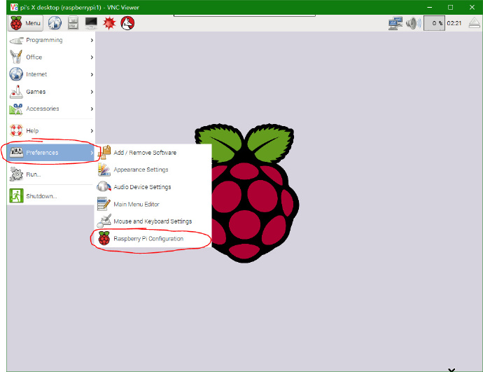
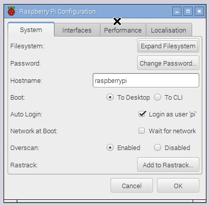
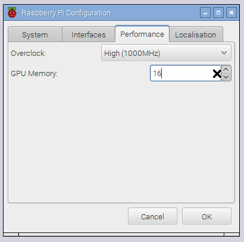

# 树莓派笔记

> 本文部分节选自：[我的世界中文论坛-在树莓派下Minecraft服务器搭建教程](https://www.mcbbs.net/thread-579651-1-1.html)、[用树莓派构建一台服务器，永久运行网站](https://www.jianshu.com/p/7fbf455f3d41)

> 相关网站:[树莓派实验室](http://shumeipai.nxez.com/)


## 安装Raspbian操作系统

从树莓派官网处[下载官方镜像](https://www.raspberrypi.org/downloads/raspbian/)。系统需要写进SD卡，需要先用到[SDFomatter](https://www.sdcard.org/chs/downloads/formatter/index.html)格式化SD卡，然后使用[Win32 Disk Imager](https://sourceforge.net/projects/win32diskimager/)对SD卡进行写盘。

等待写盘完成后，需要在电脑上找到一个刚刚烧录好的磁盘分区，名字叫`boot`，在里面创建一个文件名为`SSH`的文件（**无后缀名**），这时就可以将SD卡插回树莓派了。

> 也可以使用[balenaEtcher](https://www.balena.io/etcher/)直接对sd卡烧录镜像

为树莓派接上MicroUSB电源，如果正常的话红灯将会是常亮的，绿灯将会是闪烁的，Raspbian操作系统就成功地搭载到你的树莓派了！（如果红灯会闪烁的话那么你的电源就是不合格的了）


## 连接到树莓派

### 通过路由+网线连接

使用网线将树莓派喝路由器连接起来，其他连接了路由的设备进入路由器的管理界面，查看树莓派的ip地址，然后就可以使用PuTTY或者MobaXterm通过ssh连接树莓派，默认用户名是`pi`，密码是`raspberry`。


### 通过VNCviewer连接树莓派

#### 方法一：

在使用ssh的方式连接到树莓派之后,安装VNC服务端：

```sh
sudo apt-get install tightvncserver
```

安装完成后，需要启动VNC并设置VNC连接的端口

```sh
vncserver :1      # 这里冒号后面的数字可以修改，为你通过VNC来连接的端口号
```

然后设置密码，然后就设置完成VNC的服务器端了。

> 如果你下次开机还想通过VNC来连接的话，那么就在`/etc/init.d`这一个文件中把`vncserver:1`这条指令添加进去

这时在windows端打开[VNCviewer](https://www.realvnc.com/en/connect/download/viewer/)，输入ip和端口后即可连接到树莓派的图形化界面。

#### 方法二：

在终端输入以下命令进入配置界面。

```sh
sudo raspi-config
```

依次操作：Interfacing Options -> VNC -> Yes。之后系统会提示你是否要安装 VNC 服务，输入 y 之后回车，等待系统自动下载安装完成，一切顺利的话 VNC 服务就启动了！


### 使用Advanced IP Scanner获取树莓派ip

前往[Advanced IP Scanner](https://www.advanced-ip-scanner.com/cn/)下载并安装，安装完成后打开软件，使用软件扫描所有局域网内的设备，这个软件的优点在于：能扫描出网络设备的生产商。找到生产商是“Raspberry Pi Foundation”的机器就是树莓派。


### 通过网线连接windows笔记本电脑

网线连接已开机的树莓派，这时候前往“网络连接”中可以看到“以太网”已连接的状态，右键点击“属性”，查看“IPv4”属性，获取到ip网关（一般为`192.168.137.1`）。

#### 方法1：

打开终端，输入`arp -a`。在输出的内容中找到`192.168.137.1`这个IP，该条目下的第一行`192.168.137.27`即为树莓派的IP地址。

#### 方法2：

使用[Advanced IP Scanner](https://www.advanced-ip-scanner.com/cn/)扫描，扫描框中输入`192.168.137.0-255`，然后点击按钮开始扫描，扫描结果中找到含有”raspberrypi”字段的一行，对应的IP即为树莓派的IP。

### 设置wifi

编辑配置文件`sudo vi /etc/wpa_supplicant/wpa_supplicant.conf`

格式如下：

```conf
ctrl_interface=DIR=/var/run/wpa_supplicant GROUP=netdev
#ap_scan=1

network={
       ssid="ssid"
       scan_ssid=1
       psk="密码"
       priority=5
}
network={
       ssid="ssid"
       psk="密码"
       priority=1
}
```

**ap_scan:**1是默认值，因此我注掉了

- **1：**这个模式下总是先连接可见的WiFi，如果扫描完所有可见的网络之后都没有连接上，则开始连接隐藏WiFi。
- **2：**会按照network定义的顺序连接WiFi网络，遇到隐藏的将立刻开始连接，因此在这个模式下连接顺序不受priority影响

**ctrl_interface:**这个文件夹里面存的是一个当前使用的interface的socket文件，可以供其他程序使用读取WiFi状态信息

**network：**是一个连接一个WiFi网络的配置，可以有多个，wpa_supplicant会按照priority指定的优先级（数字越大越先连接）来连接，当然，在这个列表里面隐藏WiFi不受priority的影响，隐藏WiFi总是在可见WiFi不能连接时才开始连接。

- **ssid**:网络的ssid
- **psk**:密码
- **priority**:连接优先级，越大越优先
- **scan_ssid**:连接隐藏WiFi时需要指定该值为1

修改完成后，使用以下命令重启网络

```ruby
pi@raspberrypi:~$ sudo systemctl restart networking  #重启网卡
pi@raspberrypi:~$ sudo ifdown wlan0   
pi@raspberrypi:~$ sudo ifup wlan0     
pi@raspberrypi:~$ wpa_cli status      #查看连接状态
```


## 安装网站服务

### 安装nginx

如果镜像里默认安装了apache，则可能需要先卸载

```sh
sudo apt-get remove --purge apache* -y
sudo apt-get autoremove --purge -y
```


```sh
# 安装
sudo apt-get install nginx
# 给网页文件夹添加权限
sudo chmod -R 777 /var/www/html
# 启动
sudo /etc/init.d/nginx start
# 重启
sudo /etc/init.d/nginx restart
# 停止
sudo /etc/init.d/nginx stop
```


### 安装MySql

```sh
sudo apt install mariadb-server
sudo mysql_secure_installation
```

此时系统会询问你：`Enter current password for root (enter for none):` ,按回车（enter）键，因为第一次登陆是没有密码的。

然后会询问你： `Set root password?` —— 按 y ，进行root帐号的密码设置

此时，会提示 `New password` ,在此输入你的MySQL密码，请牢记这个密码，输入完成按回车，会提示`re-enter new password`此时再重复输入密码，回车即可。

然后，询问你 `Remove anonymous users` ，按 y 。

然后，询问你 `Disallow root login remotely` ，按 y 。

然后，询问你 `Remove test database and access to it` ，按 y 。

然后，询问你 `Reload privilege tables now` ，按 y 。

最后，您将看到消息 `All done!` 和 `Thanks for using MariaDB!` 。表示已经设置完成了。

等待安装完成后，即可进入MySql测试是否正常运行

```sh
mysql -u root -p   # 使用账号'root'登入MySQL

\q   # 退出
```

至此，MySql已经安装完成了。

如果你还想让你的数据库解除本地访问的限制，你还需要这样做：

```sh
sudo nano /etc/mysql/my.cnf
```

  使用Ctrl+W组合键来打开搜索栏，输入'bind-address'来定位到对应的一行，在该行前加上'#'来将整行代码注释掉，Ctrl+O保存，Ctrl+X退出。


### 安装PhpMyAdmin

要在php中使用MySQL，则需要安装php-mysql

```bash
sudo apt install php-mysql
```

安装完毕后，在PhpMyAdmin的官网下载最新版本:
https://www.phpmyadmin.net/

```bash
cd ~
wget https://files.phpmyadmin.net/phpMyAdmin/4.9.0.1/phpMyAdmin-4.9.0.1-all-languages.zip
```

然后，使用unzip命令解压，
再使用mv命令把phpMyAdminxxxxxxxx的文件夹移动到Nginx的网站目录下，
（这里的xxxxxxxx，是你当前的下载的版本信息）

> Nginx的默认网站目录是：/var/www/html/

这就不详细列出操作命令，
最后打开浏览器输入http://localhost/phpMyAdminxxxxxxxxxxx ,
（或者输入http://’yourIP’/phpMyAdmin-4.9.1/index.php）

即可打开PhpMyAdmin的数据库管理登陆页面。


### 安装PHP7

```sh
sudo apt-get install software-properties-common
sudo add-apt-repository ppa:ondrej/php # 安装php7的ppa源
sudo apt-get update
sudo apt-get install php7.0 php7.0-fpm php7.0-mysql php7.0-common
```

最后一行安装了PHP7.0主体，与Nginx对接的php7.0-fpm插件，与mysql对接的php7.0-mysql插件，常用函数工具php7.0-common插件。


### 重启服务

```sh
sudo /etc/init.d/nginx restart
sudo /etc/init.d/php7-fpm restart
service mysql restart
```


## 备份

> 本段来源：[树莓派学习笔记 篇四：树莓派4B 的系统备份方法大全（全卡+压缩备份）](https://post.smzdm.com/p/apzkgne7/)

### 全卡备份

在硬盘上创建一个img 后缀的空文件，打开 [Win32 Disk Imager](https://sourceforge.net/projects/win32diskimager/)，选择刚刚创建的空img 文件和 SD 卡盘符（选择boot分区的盘），点击 read 即可。

等待几分钟后就得到了备份的 img 文件，用 Win32DiskImager 来制作镜像时因为无法读取到 Linux 分区，所以是全卡备份，该方法的缺点是备份文件会和 SD 卡的容量一致，而且在还原的时候必须使用比镜像更大容量的 SD 卡。

### 压缩备份

[PiShrink](https://github.com/Drewsif/PiShrink) 是 Github 上开源的树莓派压缩工具，通过裁剪上面用 Win32DiskImager 或者 dd 命令全卡备份的镜像，去掉没有内容的分区，从而减小备份镜像的大小。

先将全卡备份的镜像文件复制到 Linux 中，打开终端运行：

```sh
wget https://raw.githubusercontent.com/Drewsif/PiShrink/master/pishrink.sh
chmod +x pishrink.sh
sudo mv pishrink.sh /usr/local/bin
```

然后执行`sudo pishrink.sh pi.img` 即可。

如果你的 linux 系统是语言是中文，可能会报错，需要设置英文运行`sudo pishrink.sh pi.img`

设置语言需要执行`sudo raspi-config`，选择`Internationalisation Options`->`Change Locale`，选择`en_US.UTF-8 UTF-8`


## 其他优化设置

### 第一次进入系统应该做的设置

推荐做以下设置：



  打开左上角的`Menu`一栏，选择其中的`Preferences`一栏，再选择`Raspberry Pi Configuration`一栏，出现系统设置界面。



- 点击`Expand Filesystem`，扩容SD卡至卡原本的大小
- 点击`Change Password`修改登录密码
- 更改菜单至`Performance`，将`Overclock`（超频）和`GPU Memory`（显存分配）设置改为下图：



> 关于显存分配，这里有几个可选值：16/32/64/128/256/512
>
> 如果你将你的树莓派用作文件服务器或Web服务器，不需要使用视频输出，你可以减少分配给GPU的内存数量（最少为16MB）
> 如果你用它来浏览网页，看视频甚至运行3D游戏，那么你应该为GPU分配较大的内存，从而提高GPU性能，使其更好地渲染3D游戏画面
> 如果你需要接入摄像头，则**至少**要为要为GPU分配128MB显存

设置完成后重启生效。


### 开机自启ssh

方法一：

```sh
sudo raspi-config
```

进入选择找到`interfacing option`选择，然后找到ssh，按回车使能enable就可以了

方法二：

在终端命令行中启动SSH服务后，如果系统重启或关机后启动，SSH服务默认是关闭的，依然需要手动启动，为了方便可以设置SSH服务开机自动启动，打开`/etc/rc.local`文件，在语句exit 0之前加入：
 `/etc/init.d/ssh start`


### 修改源

#### 修改sources.list文件

```sh
sudo nano /etc/apt/sources.list 
# 注释其他内容，选择一项添加:
# 阿里云 要装MYSql必须只能用下面的源
deb http://mirrors.aliyun.com/raspbian/raspbian/ wheezy main non-free contrib
deb-src http://mirrors.aliyun.com/raspbian/raspbian/ wheezy main non-free contrib

# 清华
deb http://mirrors.tuna.tsinghua.edu.cn/raspbian/raspbian/ wheezy main contrib non-free rpi 
deb-src http://mirrors.tuna.tsinghua.edu.cn/raspbian/raspbian/ wheezy main contrib non-free rpi 

# 东软
deb http://mirrors.neusoft.edu.cn/raspbian/raspbian/ wheezy main contrib non-free rpi 
deb-src http://mirrors.neusoft.edu.cn/raspbian/raspbian/ wheezy main contrib non-free rpi 

# 中科大
deb http://mirrors.ustc.edu.cn/raspbian/raspbian/ wheezy main contrib non-free rpi 
deb-src http://mirrors.ustc.edu.cn/raspbian/raspbian/ wheezy main contrib non-free rpi


# 最后更新软件
sudo apt-get update && apt-get upgrade -y       #更新系统软件 并 比较索引清单更新依赖关系
```


### 升级系统

```sh
sudo apt-get update
sudo apt-get dist-upgrade
```


### 安装中文字体

```sh
sudo apt-get install ttf-wqy-zenhei     # 安装文泉驿的正黑体
```

安装完成后，可在设置面板设置为中文界面了


### 查看CPU温度

```sh
/opt/vc/bin/vcgencmd measure_temp
```


### 升级npm

树莓派默认安装的npm版本是5.8.0，尝试使用`npm updata`升级但是失败了

根据GitHub上其他用户给出的[解决方法](https://github.com/nodejs/help/issues/1877#issuecomment-530152567)，执行下面的命令可以执行升级命令

```sh
curl https://www.npmjs.com/install.sh | sudo sh
```

这时候会在当前目录生成一个`node_modules`和`package.json`，删除掉即可

用这个方法能升级npm版本到6.13.6